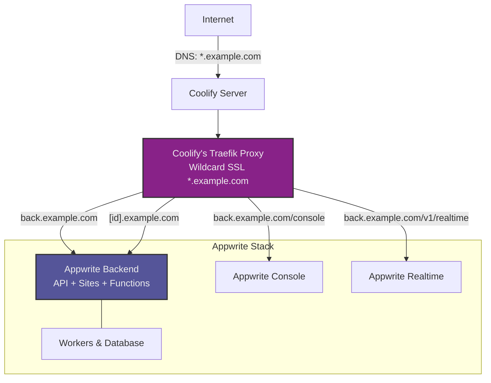
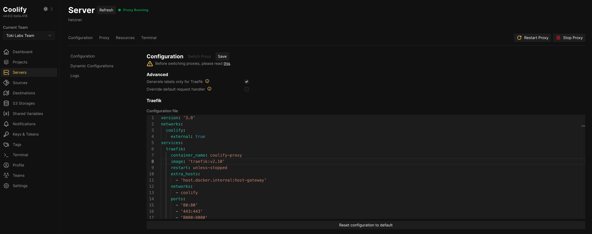

# Deploy Appwrite 1.7.4 with Wildcard SSL on Coolify

Deploy Appwrite 1.7.4 on Coolify using its built-in Traefik proxy for wildcard SSL certificates (`*.example.com`) via DNS challenge. This enables custom domains for Appwrite Sites and Functions.

## What You'll Get

- **Main API/Console:** `back.example.com`
- **Sites:** `[site-id].example.com` 
- **Functions:** `[function-id].example.com`
- **Wildcard SSL certificates** managed by Coolify's Traefik

## How It Works

This setup integrates Appwrite with Coolify's existing Traefik proxy instead of using Appwrite's built-in Traefik. Coolify's Traefik handles SSL termination and routing, while Appwrite services are configured with Docker labels for automatic discovery.



**Key Benefits:**
- Single wildcard certificate covers all subdomains
- Centralized SSL management through Coolify
- No need for Appwrite's internal Traefik
- Automatic routing via Docker labels

## Prerequisites

- Coolify instance with Traefik proxy enabled
- Domain managed by a [supported DNS provider](https://doc.traefik.io/traefik/https/acme/#providers)
- DNS provider API credentials
- Server's public IP address

**Note:** Traefik supports [50+ DNS providers](https://doc.traefik.io/traefik/https/acme/#providers) including AWS Route53, DigitalOcean, Google Cloud DNS, Azure DNS, and many others. This guide provides templates for Cloudflare and Porkbun as examples.

## Quick Start

The deployment process involves **4 main steps**:

1. **Download and prepare configuration templates**
2. **Reconfigure Coolify's Traefik for wildcard certificates**
3. **Create and configure Appwrite resource in Coolify**
4. **Deploy and verify**

Since all templates require customization with your specific values, it's recommended to download and prepare them locally before starting the deployment.

## Step 1: Download and Prepare Templates

### 1.1 Download Required Files

Download these template files to your local machine:

**Example templates provided:**
- [`config/traefik/cloudflare.yml`](./config/traefik/cloudflare.yml) - Traefik configuration for Cloudflare
- [`config/traefik/porkbun.yml`](./config/traefik/porkbun.yml) - Traefik configuration for Porkbun
- [`appwrite-compose.yml`](./appwrite-compose.yml) - Docker Compose file
- [`appwrite.env`](./appwrite.env) - Environment variables

**For other DNS providers:** Use the provided templates as a reference and consult the [Traefik DNS providers documentation](https://doc.traefik.io/traefik/https/acme/#providers) for specific configuration requirements. Each provider requires different environment variables and configuration parameters.

### 1.2 Customize Traefik Configuration

Edit your DNS provider configuration file based on your provider.

> [!TIP]
> Search for `[EDIT]` in your text editor to quickly find all placeholders that need to be replaced.

**Example: Cloudflare configuration (`cloudflare.yml`):**
```yaml
# Replace these placeholders:
- CLOUDFLARE_DNS_API_TOKEN=<-[EDIT]- PASTE YOUR CLOUDFLARE API TOKEN HERE ->
- '--certificatesresolvers.letsencrypt.acme.email=<-[EDIT]- YOUR EMAIL HERE ->'
- "traefik.http.routers.traefik-secure.rule=Host(`traefik.<-[EDIT]- YOUR DOMAIN HERE ->`)"
- "traefik.http.routers.traefik-secure.tls.domains[0].main=<-[EDIT]- YOUR DOMAIN HERE ->"
- "traefik.http.routers.traefik-secure.tls.domains[0].sans=*.<-[EDIT]- YOUR DOMAIN HERE ->"
```

**Example: Porkbun configuration (`porkbun.yml`):**
```yaml
# Replace these placeholders:
- PORKBUN_API_KEY=<-[EDIT]- PASTE YOUR PORKBUN API TOKEN HERE ->
- PORKBUN_API_SECRET=<-[EDIT]- PASTE YOUR PORKBUN API SECRET HERE ->
- '--certificatesresolvers.letsencrypt.acme.email=<-[EDIT]- YOUR EMAIL HERE ->'
- "traefik.http.routers.traefik-secure.tls.domains[0].main=<-[EDIT]- YOUR DOMAIN HERE ->"
- "traefik.http.routers.traefik-secure.tls.domains[0].sans=*.<-[EDIT]- YOUR DOMAIN HERE ->"
```****

**For other DNS providers:** Configure according to your provider's specific requirements. See the [Coolify Traefik wildcard configuration guide](https://coolify.io/docs/knowledge-base/proxy/traefik/wildcard-certs) for general setup instructions and the [Traefik DNS challenge documentation](https://doc.traefik.io/traefik/https/acme/#providers) for provider-specific environment variables and settings.

### 1.3 Customize Environment Variables

Edit `appwrite.env` and replace all placeholder values.

> [!TIP]
> **💡 Tip:** Search for `[EDIT]` in your text editor to quickly find all placeholders that need to be replaced.

**Critical settings to update:**
```env
# Domain configuration
_APP_DOMAIN=<!-[EDIT]- YOUR DOMAIN ->
_APP_DOMAIN_FUNCTIONS=<!-[EDIT]- YOUR DOMAIN ->
_APP_DOMAIN_SITES=<!-[EDIT]- YOUR DOMAIN ->
_APP_DOMAIN_TARGET_A=<!-[EDIT]- YOUR SERVER PUBLIC IPV4 ->
_APP_DOMAIN_TARGET_CNAME=<!-[EDIT]- YOUR DOMAIN ->

# Security keys (generate 32-character random strings)
_APP_OPENSSL_KEY_V1=<!-[EDIT]- YOUR SUPER SECRET APPWRITE OPENSSL KEY ->
_APP_EXECUTOR_SECRET=<!-[EDIT]- YOUR SUPER SECRET APPWRITE EXECUTOR KEY ->

# Database credentials
_APP_DB_USER=<!-[EDIT]- CREATE A STRONG APPWRITE DB USER ->
_APP_DB_PASS=<!-[EDIT]- CREATE A STRONG APPWRITE DB PASSWORD ->
_APP_DB_ROOT_PASS=<!-[EDIT]- CREATE A STRONG MARIADB ROOT PASSWORD ->

# System email
_APP_SYSTEM_EMAIL_NAME=<!-[EDIT]- EMAIL SENDER NAME ->
_APP_SYSTEM_EMAIL_ADDRESS=<!-[EDIT]- EMAIL SENDER EMAIL ->

# Console hostnames
_APP_CONSOLE_HOSTNAMES=<!-[EDIT]- YOUR DOMAIN ->
```

**Important:** Both `_APP_DOMAIN_FUNCTIONS` and `_APP_DOMAIN_SITES` should be set to your root domain (e.g., `example.com`) so that custom sites and functions get direct subdomains like `[id].example.com`, which are covered by the `*.example.com` wildcard certificate.

## Step 2: Configure DNS Records

Set up these DNS records in your DNS provider:

1. **A Record for backend:**
   - Name: `back`
   - Value: `YOUR_SERVER_IP`
   - Proxy: **DNS only** (gray cloud in Cloudflare)

2. **Wildcard CNAME:**
   - Name: `*`
   - Value: `back.example.com`
   - Proxy: **DNS only** (gray cloud in Cloudflare)

## Step 3: Reconfigure Coolify's Traefik

1. **Access Traefik Configuration**
   - Go to Coolify dashboard → Server → Proxy
   - Open the "Configuration file" editor

   

2. **Replace Configuration**
   - Copy the content from your prepared Traefik configuration file (`cloudflare.yml` or `porkbun.yml`)
   - Paste it into the Coolify configuration editor
   - **Important:** Verify the network name matches your Coolify setup (usually `coolify`)

3. **Save and Restart**
   - Save the configuration
   - Restart the proxy
   - Monitor logs for any errors in the restart process

## Step 4: Deploy Appwrite in Coolify

> [!IMPORTANT]
> The Compose file has variables, so before saving it you need to uncheck the option "Escape special characters"
> 

> [!TIP]
> Use the "Show Deployable Compose" in the screen above to confirm Coolify is correctly replacing the variables in the docker compose with the values use set in the environment.

1. **Create New Resource**
   - Go to Server → Resources → Add New → Docker Compose

2. **Add Docker Compose Configuration**
   - Copy the content from your prepared `appwrite-compose.yml`
   - Paste it into the Coolify Docker Compose editor

3. **Add Environment Variables**
   - Go to "Environment Variables" tab
   - Copy the content from your prepared `appwrite.env`
   - Paste it into the environment variables section

4. **Verify Networks**
   - Ensure the external network name in the compose file matches Coolify's proxy network
   - Usually `coolify` - verify this matches your Traefik configuration

5. **Deploy**
   - Click **Deploy**
   - Monitor deployment logs in real-time
   - Wait for all services to start successfully

## Step 5: Verify Setup

1. **Test Console Access**
   - Visit `https://back.example.com/console`
   - You should see the Appwrite setup screen
   - Complete the initial Appwrite configuration

2. **Test SSL Certificate**
   - Verify the wildcard certificate is working
   - Check that the connection is secure (HTTPS)

3. **Test Custom Domains**
   - Create a project in Appwrite console
   - Deploy a test site or function
   - Verify custom domain works with HTTPS (e.g., `https://[unique-id].example.com`)

## Troubleshooting

### SSL Certificate Issues
- **Check Traefik logs:** Server → Proxy → Logs
- **Verify API credentials:** Ensure your DNS provider API token/key has correct permissions
- **Check DNS records:** Ensure DNS records are not proxied (gray cloud in Cloudflare)
- **Test staging:** Uncomment the staging ACME server line in Traefik config for testing

### Routing Problems
- **Verify network name:** Check that network name matches between Traefik config and Appwrite stack
- **Check Traefik labels:** Review Traefik labels in Docker Compose file
- **Access Traefik dashboard:** If accessible, review routing rules

### Appwrite Service Issues
- **Check service logs:** Monitor individual service logs in Coolify
- **Verify environment variables:** Ensure all required variables are set correctly
- **Database connectivity:** Verify database credentials and connectivity
- **Resource limits:** Check if services have sufficient resources

### Common Configuration Errors
- **Domain mismatch:** Ensure all domain references are consistent
- **Network connectivity:** Verify services can communicate on the internal network
- **Secret keys:** Ensure all secret keys are properly generated and set

## Network Configuration

The setup uses these networks:
- **`coolify`** - Coolify's main proxy network (external)
- **`appwrite-internal-${COOLIFY_RESOURCE_UUID}`** - Internal Appwrite services communication
- **`appwrite-runtimes-${COOLIFY_RESOURCE_UUID}`** - OpenRuntimes executor network

**Important:** The `${COOLIFY_RESOURCE_UUID}` variable is automatically provided by Coolify to ensure network isolation between different resources.

## Security Considerations

- **Generate strong secrets:** Use proper random generators for `_APP_OPENSSL_KEY_V1` and `_APP_EXECUTOR_SECRET`
- **Database security:** Use strong, unique passwords for database accounts
- **API credentials:** Secure your DNS provider API credentials with minimal required permissions
- **Network isolation:** The setup provides proper network isolation between services
- **SSL/TLS:** All traffic is encrypted with automatically renewed certificates

## References

- [Coolify Traefik Configuration](https://coolify.io/docs/knowledge-base/proxy/traefik/wildcard-certs)
- [Traefik DNS Challenge and Providers](https://doc.traefik.io/traefik/https/acme/#providers)
- [Appwrite Documentation](https://appwrite.io/docs)
- [Cloudflare API Tokens](https://developers.cloudflare.com/fundamentals/api/get-started/create-token/)
- [Porkbun API Documentation](https://porkbun.com/api/json/v3/documentation)
